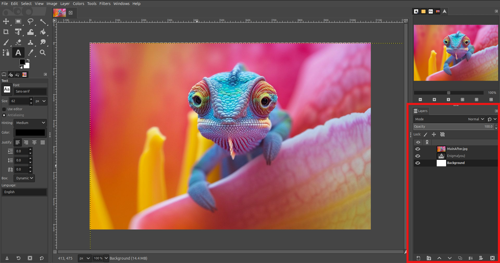
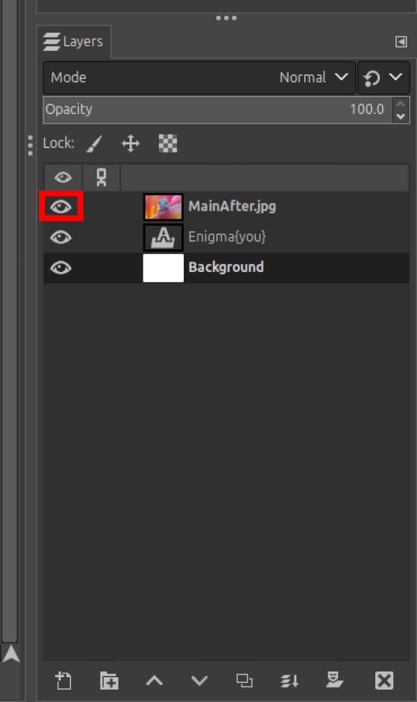
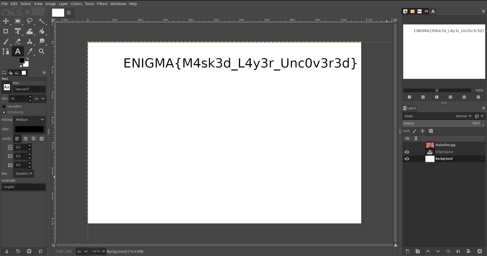

# Buried Truths

## Overview

The **"Buried Truths"** challenge presents participants with a GIMP file (`.xcf`), where a hidden message (the flag) is concealed beneath layers of images. Participants are tasked with uncovering the hidden text by exploring the file's structure.

## Challenge Description

Participants are provided with an `.xcf` file, which is a native file format for GIMP, a popular open-source image editor. This file contains multiple layers, and the flag is hidden under one or more of these layers. The challenge is to use GIMP to inspect and manipulate the layers to reveal the flag.

The file consists of three layers:

1. **Main Image Layer**: This is the visible layer and appears as the main content of the file.
2. **Text Layer**: Contains the hidden flag as text. Some may mistake the layer name as the flag, but it is not.
3. **White Image Layer**: A plain white layer that adds an extra layer of concealment.

The objective is to uncover the hidden text by interacting with the layers.

---

## Solution Approach

To reveal the hidden text, follow these steps:

### Step 1: Install and Open GIMP

1. **Download GIMP**: If not already installed, download and install GIMP from the official website: [https://www.gimp.org/](https://www.gimp.org/).
2. **Open the File**: Launch GIMP and open the provided `.xcf` file.

### Step 2: Access the Layers Panel

- Locate the **Layers** tab, typically on the right-hand side of the GIMP interface. If it's not visible, enable it by navigating to:
  **Windows > Dockable Dialogs > Layers**.

### Step 3: Inspect the Layers

- The `.xcf` file contains three layers:
  1. **Main Image Layer**: The topmost layer, obscuring the layers beneath.
  2. **Text Layer**: Contains the hidden flag as text.
  3. **White Image Layer**: The bottommost layer, providing a plain white background.

### Step 4: Reveal the Hidden Text

1. **Hide the Main Image Layer**: Click the **eye icon** next to the Main Image Layer in the Layers panel to hide it.
2. **Examine the Text Layer**: The Text Layer will now be visible. Look for the hidden flag in the content of this layer.
3. **Ignore the Layer Name**: Many participants may mistakenly think the layer's name is the flag, but this is incorrect. Focus on the content within the layer.

---

## Example Solution Steps

<b>Step - 1.</b> Open the provided <i>.xcf</i> file in GIMP.

 
<b>Step - 2.</b> Navigate to the Layers panel.

 
<b>Step - 3.</b> Hide the topmost layer (Main Image Layer) by clicking the eye icon.

 
<b>Step - 4.</b> Observe the middle layer (Text Layer) to reveal the hidden text.

 
<b>Step - 5.</b> Ignore the name of the layer (Enigma{you}) and focus on its actual content (<kbd><samp>ENIGMA{M4sk3d_L4y3r_Unc0v3r3d}</samp></kbd>).

---

## Conclusion

The **"Buried Truths"** challenge tests participants' ability to explore and manipulate layers in a GIMP file to uncover hidden information. By understanding the structure of the `.xcf` file and properly interacting with its layers, participants can successfully reveal the hidden flag.

Happy uncovering! 🎉
