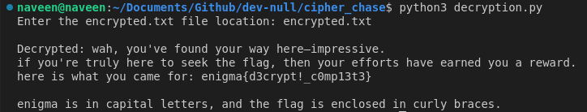

# Cipher Chase Challenge

## Overview

Participants are tasked with decrypting a given `encrypted.txt` file. The encryption process combines three cipher techniques: **Columnar Transposition Cipher**, **Vigenère Cipher**, and **Substitution Cipher**. To solve this challenge, participants must write a decryption script to reverse the encryption process and recover the original plaintext.

Additionally, the challenge requires participants to deduce the **original key** used for encryption. While some hints are embedded in the context, careful observation and pattern analysis will help uncover the correct key.

---

## Challenge Description

You are provided with the following:
1. **`encrypted.txt`**: The file containing the fully encrypted text in which flag is included.
2. **`encryption.py`**: The Python script that describes the encryption process.

### Objective

1. Write a decryption script that reverses the three layers of encryption.
2. Identify the original key used during the encryption process.

### Encryption Process (For Reference)
After analyzing the provided code, we can deduce that the encryption process involves the following three techniques:

1. **Columnar Transposition Cipher:**
    - The plaintext is rearranged into columns based on a key and then read in a scrambled order.

2. **Vigenère Cipher:**
    - A polyalphabetic substitution is applied to the text using the same key.

3. **Substitution Cipher:**
    - Each character in the text is mapped to another character based on a shuffled key.

## Solution Approach

### **Step 1: Understand the Decryption Process**

To decrypt the text, reverse the encryption steps:
1. **Substitution Cipher Decryption**:
   - Reverses the character mapping.
2. **Vigenère Cipher Decryption**:
   - Reverses the polyalphabetic substitution using the same key.
3. **Columnar Transposition Cipher Decryption**:
   - Rearranges the text back into its original row-order based on the key.

### **Step 2: Write the Decryption Code**

Use the provided encryption script as a reference to implement the decryption logic. Here's a high-level structure for the decryption code:

1. Implement a function to reverse the substitution cipher.
2. Implement a function to reverse the Vigenère cipher.
3. Implement a function to reverse the columnar transposition cipher.
4. Chain these functions in reverse order to decrypt the text.

### **Step 3: Identify the Key**

The original encryption key is crucial for decryption. Participants are encouraged to:
- Analyze the patterns in the decrypted text.
- Consider logical guesses for the key (e.g., the contest's name or theme).

> **Hint:** The key is related to the contest and is a meaningful word.

---

## **Example Decryption Script**

Below is a sample decryption code:

```python
import string
from itertools import cycle


def columnar_transpose_decrypt(encrypted_text: str, key: str) -> str:
    """
    Decrypts text encrypted by the columnar transposition cipher.

    Args:
        encrypted_text (str): The columnar transposition cipher encrypted text.
        key (str): The key used for the columnar transposition cipher.

    Returns:
        str: The decrypted text.
    """
    num_columns = len(key)
    num_rows = len(encrypted_text) // num_columns
    key_order = sorted(range(len(key)), key=lambda k: key[k])

    # Reconstruct columns based on key order
    columns = [""] * num_columns
    index = 0
    for i in key_order:
        columns[i] = encrypted_text[index : index + num_rows]
        index += num_rows

    # Read out the columns in original row order
    decrypted_text = "".join(
        columns[i % num_columns][i // num_columns]
        for i in range(num_rows * num_columns)
    )
    return decrypted_text.strip()


def vigenere_cipher_decrypt(text: str, key: str) -> str:
    """
    Decrypts text encrypted by the Vigenère cipher.

    Args:
        text (str): The Vigenère cipher encrypted text.
        key (str): The key used for the Vigenère cipher.

    Returns:
        str: The decrypted text.
    """
    decrypted_text = []
    for char, key_char in zip(text, cycle(key)):
        if char.isalpha():
            shift = ord(key_char.lower()) - ord("a")
            decrypted_char = chr(((ord(char) - ord("a") - shift + 26) % 26) + ord("a"))
            decrypted_text.append(decrypted_char)
        else:
            decrypted_text.append(char)
    return "".join(decrypted_text)


def substitution_cipher_decrypt(text: str) -> str:
    """
    Decrypts text encrypted by the substitution cipher.

    Args:
        text (str): The substitution cipher encrypted text.

    Returns:
        str: The decrypted text.
    """
    alphabet = list(string.ascii_lowercase)
    shuffled_key = sorted(set(key), key=key.index)
    remaining_chars = [char for char in alphabet if char not in shuffled_key]
    substitution_order = shuffled_key + remaining_chars
    substitution_alphabet = dict(zip(alphabet, substitution_order))

    inverse_substitution = {v: k for k, v in substitution_alphabet.items()}
    return "".join(inverse_substitution.get(char, char) for char in text)


def decrypt(encrypted_text: str, key: str) -> str:
    """
    Reverses three levels of encryption: substitution cipher, Vigenère cipher, and columnar transposition cipher.

    Args:
        encrypted_text (str): The fully encrypted text.
        key (str): Key that is used to decrypt the encrypted file
    Returns:
        str: The original plaintext.
    """
    # Level 3: Reverse Substitution Cipher
    level_3_decryption = substitution_cipher_decrypt(encrypted_text)
    # Level 2: Reverse Vigenère Cipher
    level_2_decryption = vigenere_cipher_decrypt(level_3_decryption, key)
    # Level 1: Reverse Columnar Transposition Cipher
    return columnar_transpose_decrypt(level_2_decryption, key)

if __name__ == "__main__":
    key = "enigma"
    key = key.lower()
    file_location = input("Enter the encrypted.txt file location: ") or "encrypted.txt"
    try:
        with open(file_location, "r") as file:
            encypted_txt = file.read()
    except FileNotFoundError:
        print(f"encrypted.txt file not found in the location: '{file_location}'")
        exit(1)
    decrypted_text = decrypt(encypted_txt, key)
    print()
    print("Decrypted:", decrypted_text)
```

### Sample Ouput:



---

## Conclusion

This challenge tests participants' ability to:
1. Analyze encryption techniques.
2. Write Python code to implement decryption algorithms.
3. Deduce the encryption key through observation and logical reasoning.

Good luck, and happy decrypting!