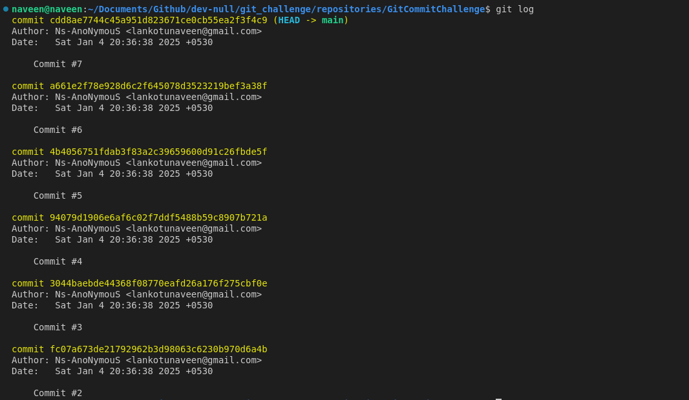
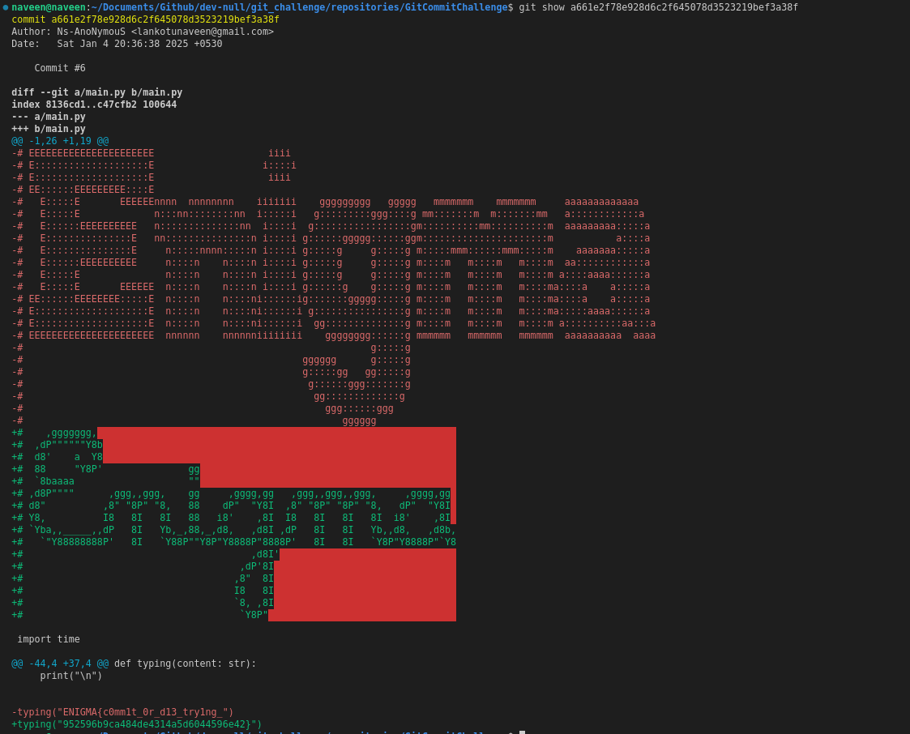
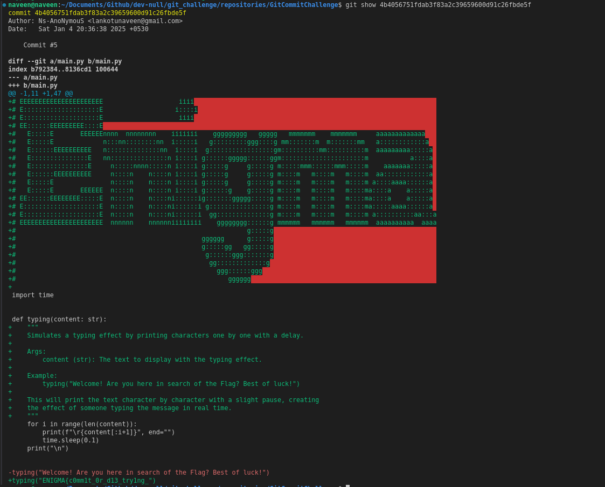

# Git Challenge

## Overview

The **"Git Challenge"** challenge presents participants with a zip file containing a Git repository. The hidden flag lies within the repository's commit history, and participants must use Git commands to uncover it.

## Challenge Description

Participants are provided with a zip file that, when extracted, contains a Git repository. The flag is hidden in the history of two specific commits (commit 5 and commit 6). The challenge is to use Git commands to analyze the commit history and extract the flag.

The repository contains multiple commits, with the flag distributed across two of them. Participants must carefully inspect these commits to reconstruct the flag.

---

## Solution Approach

To uncover the hidden flag, follow these steps:

### Step 1: Extract the Zip File

1. **Download the File**: Use the provided link to download the zip file.
2. **Unzip the File**: Extract the contents using the following command:
   ```bash
   unzip <file_name>.zip
   ```

### Step 2: Navigate to the Repository

1. **Change Directory**: Navigate to the extracted Git repository:
   ```bash
   cd <repository_directory>
   ```

### Step 3: Inspect the Commit History

1. **View the Commit Log**: Use the `git log` command to view the commit history:
   ```bash
   git log
   ```
   This will display the list of commits with their hashes, authors, and messages.

### Step 4: Analyze Specific Commits

1. **Check Commit 6**: Use the `git show` command to view the changes in commit 6:
   ```bash
   git show <commit_6_hash>
   ```
2. **Check Commit 5**: Similarly, inspect commit 5:
   ```bash
   git show <commit_5_hash>
   ```
3. **Combine the Clues**: The flag is split across these two commits. Combine the information from both to reconstruct the flag.

---

## Example Solution Steps

<center>
<br>
<b>Step - 1.</b> Use `git log` to view the commit history.


p
<br>
<b>Step - 2.</b> Inspect commit 6 to find part of the flag.



<br>
<b>Step - 3.</b> Inspect commit 5 to find the remaining part of the flag and combine the pieces.


</center>

---

## Conclusion

The **"Git Challenge"** challenge tests participants' ability to analyze a Git repository's history to uncover hidden information. By carefully exploring the commit history and understanding Git commands, participants can successfully reconstruct the flag.

Happy hunting! 🎉

